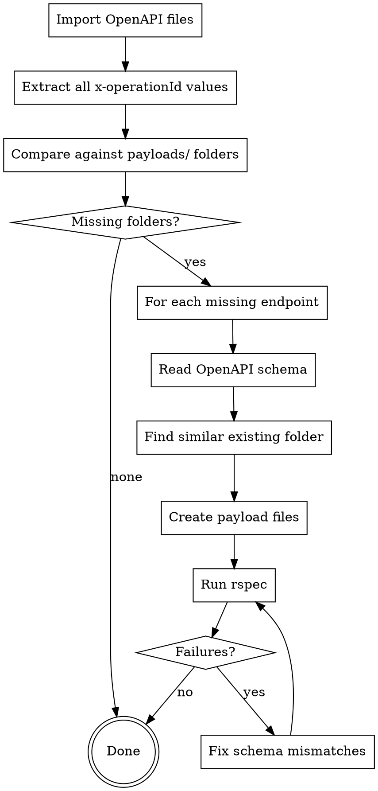

# Sync OpenAPI Specs with Staging Data Payloads

## Overview

Ensures every endpoint defined in the SIADE OpenAPI specs has a corresponding payload folder in `payloads/` with valid test cases. Imports latest specs, finds gaps, creates missing folders with schema-compliant YAML files, and runs the test suite.

## When to Use

- User asks to import/sync OpenAPI files and check for missing payloads
- User asks to add staging data for new endpoints
- User asks to check coverage of payload folders against OpenAPI specs
- After new endpoints are added to the apistration/siade OpenAPI files

## Workflow



## Step 1: Import OpenAPI Files

```bash
bash bin/import_latest_open_api_files.sh ../apistration/siade
```

This copies the 3 OpenAPI YAML files into `openapi_files/`.

## Step 2: Find Missing Payload Folders

Compare all `x-operationId` values from OpenAPI files against existing `payloads/` directories:

```bash
grep -h 'x-operationId:' openapi_files/*.yaml | sed 's/.*x-operationId: *//' | sort -u > /tmp/openapi_ids.txt
ls payloads/ | sort -u > /tmp/payload_dirs.txt
comm -23 /tmp/openapi_ids.txt /tmp/payload_dirs.txt
```

Ignore malformed operation IDs (e.g. `api_entreprise_vrivileges_`).

## Step 3: Create Missing Payload Folders

For each missing endpoint:

### 3a. Identify the OpenAPI Schema

```bash
grep -n 'x-operationId: <operation_id>' openapi_files/<api_file>.yaml
```

Then read ~200 lines from that point to get the full response schema, including required fields, types, and enums.

### 3b. Find a Similar Existing Folder as Template

Map the missing endpoint to an existing one:

| Missing endpoint pattern | Copy from |
|--------------------------|-----------|
| `v4_*` endpoint | Corresponding `v3_*` folder (add new v4-specific fields) |
| `*_with_france_connect` | Similar `*_with_civility` folder (use FC param pattern) |
| Same provider, different endpoint | Another endpoint from the same provider |

### 3c. Create YAML Payload Files

Each folder needs **at minimum**:
- One `200.yaml` (or descriptive name) with a valid success response
- One error file (e.g. `404.yaml`) if the OpenAPI spec defines that error response

**Critical rules:**
- Every file needs unique `params` within its folder (CLAUDE.md requirement)
- Every file must end with a newline
- Standard structure: `description`, `params`, `status`, `payload`
- Payload must be valid JSON matching the OpenAPI schema exactly

**File format:**
```yaml
---
description: 'Description of the test case'
params:
  siren: '552049447'
status: 200
payload: |-
  {
    "data": { ... },
    "links": {},
    "meta": {}
  }
```

**Parameter patterns by API type:**

| API | Common params |
|-----|--------------|
| API Entreprise | `siren`, `siret`, `siret_or_rna`, `siret_or_eori` |
| API Particulier (civility) | `nomNaissance`, `prenoms[]`, `anneeDateNaissance`, `moisDateNaissance`, `jourDateNaissance`, `sexeEtatCivil`, `codeCogInseeCommuneNaissance` |
| API Particulier (FranceConnect) | Same as civility but with `codeInseeLieuDeNaissance`, `codePaysLieuDeNaissance` |
| API Particulier (INE) | `ine` (11 alphanumeric chars) |
| API Particulier (identifiant) | `identifiant` |

**Error response pattern:**
```yaml
payload: |-
  {
    "errors": [
      {
        "code": "XXXXX",
        "title": "Entite non trouvee",
        "detail": "Description of the error.",
        "source": null,
        "meta": {
          "provider": "Provider Name"
        }
      }
    ]
  }
```

### 3d. Only Create Error Files for Defined Responses

Check which HTTP status codes are defined in the OpenAPI spec for each endpoint. If the spec only defines `200`, `401`, `403`, `422`, `429` (but not `404`), do NOT create a `404.yaml`.

## Step 4: Check open_api_helpers.rb

The test helper at `lib/open_api_helpers.rb` routes operation IDs to the correct OpenAPI file. If new API version prefixes are introduced, update `extract_open_api_name`:

```ruby
def extract_open_api_name(operation_id)
  base_name = File.basename(operation_id)
  if base_name.start_with?('api_particulier_v2')
    'api_particulier_v2'
  elsif base_name.start_with?('api_particulier_v3') || base_name.start_with?('api_particulier_v4')
    'api_particulier'
  else
    'api_entreprise'
  end
end
```

If a new version prefix appears (e.g. `api_particulier_v5`), add it here.

## Step 5: Run Tests and Fix

```bash
LOCAL=1 bundle exec rspec
```

Use `LOCAL=1` to validate against local OpenAPI files (not remote).

**Common validation failures:**
- Missing required fields in payload - read OpenAPI schema and add them
- Extra fields not in schema (`additionalProperties: false`) - remove them
- Wrong types (object vs array, string vs boolean) - match schema exactly
- Wrong enum values - check exact values in OpenAPI spec
- Files owned by root (from Docker) - `sudo chown $USER:$USER` them

After fixing, regenerate READMEs:

```bash
bundle exec ruby bin/generate_payload_readme.rb
```

## Parallelization Strategy

When creating many folders, use parallel agents grouped by similarity:
- API Particulier civility/FC endpoints together
- API Entreprise v4 INSEE endpoints together (batch copy from v3)
- API Entreprise misc endpoints in groups of 7-8

## Common Mistakes

- Creating error files for HTTP codes not defined in the OpenAPI spec (causes nil errors in tests)
- Guessing payload structure instead of reading the actual OpenAPI schema
- Forgetting `additionalProperties: false` means NO extra fields allowed
- Not updating `open_api_helpers.rb` when new version prefixes appear
- Forgetting to fix root-owned files after Docker test runs
